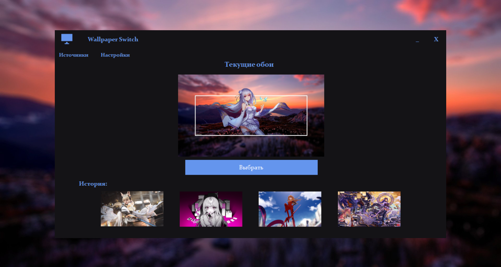
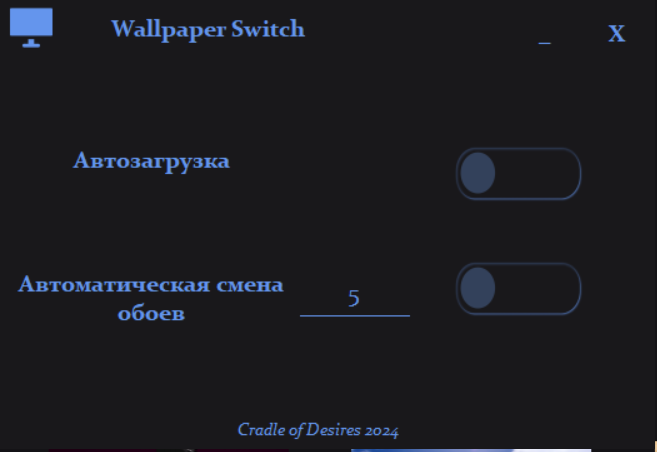
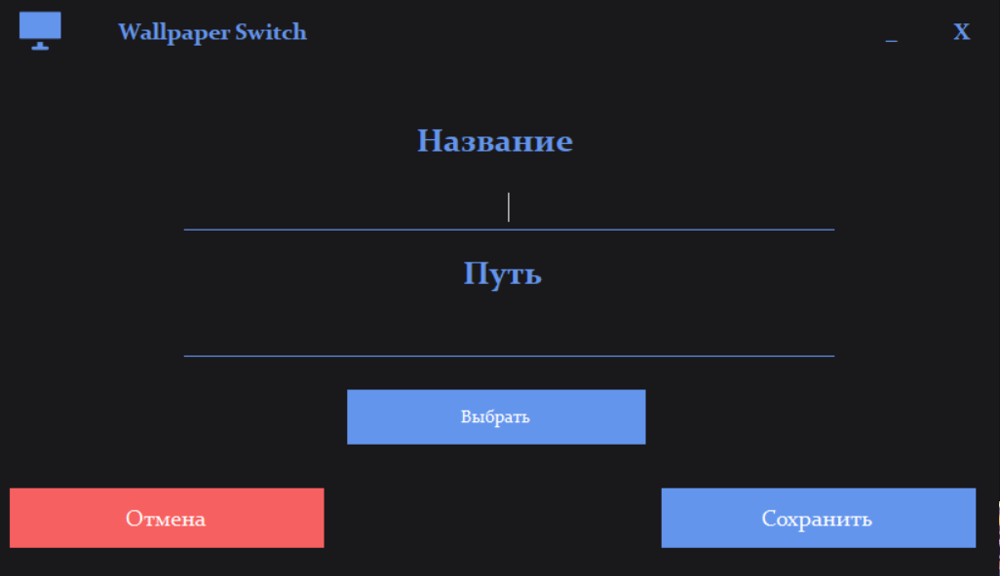

# Wallpaper Switch

## Описание: 

> Wallpaper Switch - это инструмент для смены обоев на компьютере. С его помощью вы сможете быстро и легко выбрать новые обои для вашего рабочего стола.

## Стек:

> Net Framework 4.7.2

> Windows Forms

> MsTest

## Установка:

> Скачайте архив с последней версией приложения

> Распакуйте архив в удобное для вас место

> Запустите Wallpaper Switch.exe

## Инструкция:

> Для использования приложения необходима папка с изображениями, которые будут установлены на рабочий стол

> Добавление источника

1. Нажмите на кнопку "Источники"
2. Нажмите на кнопку "+"
3. Нажмите на кнопку "Выбрать"
4. Выберете папку с изображениями 
5. Нажмите сохранить 
6. На главном окне нажимите кнопку выбрать, что б установить новое случайное изображение

## Галерея:

  
  
  

